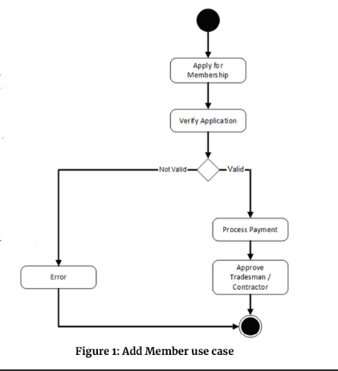

# cc1ArchitechtureLogiciel
### Sujet CC1

**Contenu :**

Conception & développement d’un module logiciel de gestion des inscriptions
d’une solution e-commerce, comportant une fonction d’ajout d’un membre.

**Modalité :**

Respect des patterns logiciels et des concepts objets (pattern repository,
injection de dépendances, programmation par interfaces, etc)
Respect de ‘l’intention’ dans le code.
Justifier certains critères de qualité.
Langage: Java 11 ou +.

**Modalités de livraison :**

Rendu: Tag d’un repository GIT sous GitHub/GitLab/BitBucket

